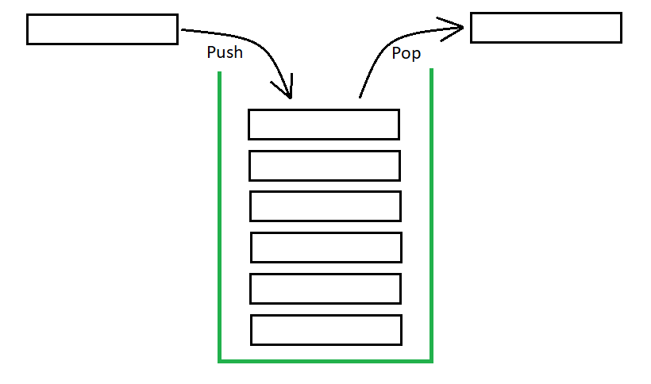

# Stack

## 1. Stack là gì?

Stack (ngăn xếp) là một cấu trúc dữ liệu hoạt động theo nguyên tắc **LIFO** (_Last In, First Out_), nghĩa là phần tử được đưa vào sau cùng sẽ được lấy ra đầu tiên, tức là một kiểu danh sách mà việc bổ sung và loại bỏ một phần tử được thực hiển ở cuối danh sách. Vị trí cuối cùng của stack gọi là đỉnh (top) của ngăn xếp.



Stack giống như việc giáo viên kiểm tra vở bài tập của học sinh vậy, ai nộp sau cùng thì vở bài tập của người đó sẽ được giáo viên kiểm tra đầu tiên, đương nhiên người nộp vợ đầu tiên sẽ được kiểm tra cuối cùng.

## 2. Cách sử dụng Stack trong Java

Trong Java, Stack được cung cấp sẵn thông qua lớp `Stack` trong gói `java.util`.

## 3. Các phương thức chính của Stack

| Phương thức        | Mô tả                                                                                        |
| ------------------ | -------------------------------------------------------------------------------------------- |
| `push(E item)`     | Thêm một phần tử vào đầu Stack                                                               |
| `pop()`            | Lấy phần tử trên cùng của Stack và xóa nó                                                    |
| `peek()`           | Lấy phần tử trên cùng của Stack nhưng không xóa                                              |
| `isEmpty()`        | Kiểm tra xem Stack có rỗng không                                                             |
| `search(Object o)` | Tìm kiếm một phần tử trong Stack, trả về vị trí của nó (1-based), hoặc -1 nếu không tìm thấy |

## 4. Ví dụ sử dụng Stack

```java
import java.util.Stack;

public class StackExample {
    public static void main(String[] args) {
        Stack<Integer> stack = new Stack<>();

        // Thêm phần tử vào Stack
        stack.push(10);
        stack.push(20);
        stack.push(30);
        System.out.println("Stack sau khi push: " + stack);

        // Lấy phần tử trên cùng nhưng không xóa
        System.out.println("Phần tử trên cùng (peek): " + stack.peek());

        // Lấy phần tử trên cùng và xóa
        System.out.println("Phần tử bị pop: " + stack.pop());
        System.out.println("Stack sau khi pop: " + stack);

        // Kiểm tra rỗng
        System.out.println("Stack có rỗng không? " + stack.isEmpty());

        // Tìm kiếm phần tử
        System.out.println("Vị trí của 10 trong stack: " + stack.search(10));
    }
}
```

## 5. Ứng dụng của Stack

- **Quản lý undo/redo trong trình soạn thảo văn bản**
- **Hệ thống gọi hàm (recursion call stack)**
- **Chuyển đổi biểu thức toán học (infix → postfix, prefix)**
- **Duyệt cây (Tree Traversal)**
- **Kiểm tra dấu ngoặc trong biểu thức toán học**

Lưu ý: Khi sử dụng `Stack`, nếu cần thao tác đa luồng, bạn có thể xem xét sử dụng `Deque` với `LinkedList` để có hiệu suất tốt hơn.
